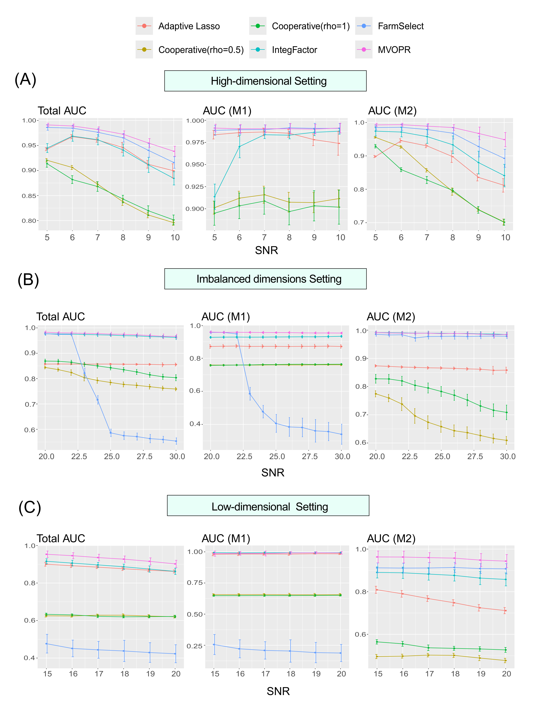
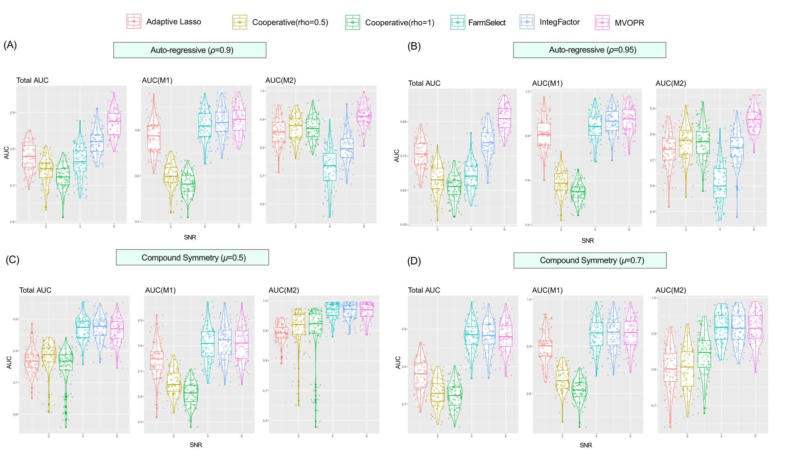

# MVOPR: Multi-View Orthogonal Projection Regression for Multi-omics Data

**Authors:** Zongrui Dai, Yvonne J. Huang, Gen Li (University of Michigan)

MVOPR is a variable-selection method for multi-omics regression. Multi-omics features often have strong **intra-** and **inter-modality** correlation. These correlations induce multicollinearity and make standard Lasso-type selection unstable. MVOPR uses the **unidirectional** structure among omics layers (e.g., microbiome → metabolome, inspired by the central dogma) to project correlated views into **orthogonal** feature spaces, then runs penalized regression on the de-correlated components.

An R package is available on CRAN: [MVOPR](https://cran.r-project.org/web/packages/MVOPR).

---

## Method in brief

### Two-modality model

Let $M_1 \in \mathbb{R}^{n \times p_1}$ and $M_2 \in \mathbb{R}^{n \times p_2}$ be two omics matrices and $y \in \mathbb{R}^n$ the response:

$$
y = M_1\beta_1 + M_2\beta_2 + \epsilon.
$$

Assume a unidirectional dependence $M_1 \rightarrow M_2$:

$$
M_2 = M_1 B + E,
$$

where $B$ is low-rank (estimated by reduced-rank regression) and $E$ is the residual of $M_2$ after removing the mediated pathway from $M_1$.

Take the SVD $M_1 B = UDV^{\top}$ and define the projection $P = UU^{\top}$, $P^{\perp} = I - P$. MVOPR rewrites the regression as

$$
y = M_1^{*}\beta_1 + M_2^{*}\beta_2 + U\gamma + \epsilon,
$$

$$
M_1^{*} = P^{\perp} M_1,\qquad M_2^{*} = E,
$$

where $M_1^{*}$, $M_2^{*}$, and $U$ are mutually uncorrelated. Thus $\beta_1$ and $\beta_2$ retain their original interpretation, while collinearity from the shared pathway is removed. Penalized least squares (Lasso / SCAD / MCP) is then applied to the transformed predictors.

### Multiple modalities

Under $M_1 \rightarrow M_2 \rightarrow M_3$, MVOPR sequentially residualizes and projects each modality from **downstream to upstream**, yielding mutually uncorrelated predictors $M_1^{*}$, $M_2^{*}$, $M_3^{*}$ while preserving the regression coefficients of interest.

---

## Simulation results

Variable selection is evaluated by **AUC** over a path of regularization parameters (higher is better), compared with Adaptive Lasso, Cooperative Learning ($\rho = 0.5, 1$), IntegFactor, and FarmSelect.

### 1. Two-modality settings (Figure 2)

Three scenarios with inter-modality link $M_2 = M_1 B + E$ and SNR of $E$ varied:

- **(A) High-dimensional:** $n=200$, $p_1=p_2=300$
- **(B) Imbalanced dimensions:** $p_1=50$, $p_2=300$
- **(C) Low-dimensional:** $p_1=p_2=50$

**Main findings.** MVOPR attains the highest Total AUC across SNR grids. Gains are strongest in **AUC($M_2$)** when inter-modality signal is strong, because MVOPR isolates variation in $M_2$ that is not explained by $M_1$. Factor-based competitors (especially FarmSelect) can degrade when the shared structure is higher-rank or dimensions are imbalanced.



*Figure: AUC for each model by SNR of $E$ in high-dimensional, imbalanced, and low-dimensional settings.*

### 2. Misspecified residual covariance (Simulation 2)

Same high-dimensional spirit as above, but residuals $E$ are **not** independent: Auto-Regressive (AR1, $\rho = 0.9, 0.95$) and Compound Symmetry ($\mu = 0.5, 0.7$) structures.

**Main findings.** MVOPR remains the strongest or near-strongest method for Total AUC and AUC($M_2$) under correlated noise, indicating robustness when the independent-$E$ assumption is violated.



*Figure: AUC under AR and compound-symmetry residual covariance (misspecified case).*

---

## Repository structure

| Path | Description |
|------|-------------|
| `Functions.R` | MVOPR, factor-based models, RRR, and data generation helpers (**load this first**) |
| `R package/` | Packaged MVOPR release (also on CRAN) |
| `Real Data Analysis/` | CAARS real-data analysis code |
| `Simulation.1/` | Two-modality simulations (high-dim / imbalanced / low-dim) |
| `Simulation.2/` | Misspecified residual covariance (AR / CS) and null settings |
| `Simulation.3/` | Three-modality simulations |
| `figures/` | Simulation figures used in this README |

> CSV/XLSX data files are intentionally excluded from this repository.

---

## Quick start

```r
source("Functions.R")
# Then run scripts under Simulation.*/ or Real Data Analysis/
```

For the packaged implementation:

```r
install.packages("MVOPR")
library(MVOPR)
```
